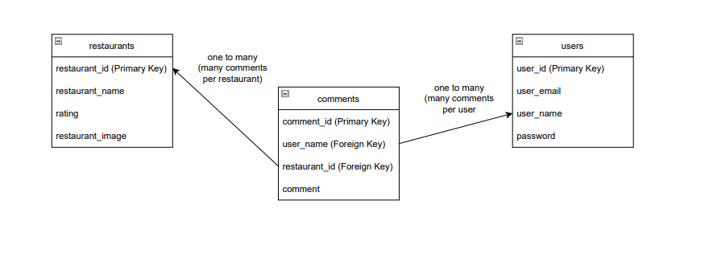

# Restaurant-Gallery-API

## Project link

### https://restaurant-gallery.herokuapp.com/

## Repository link

### Front-End: https://github.com/OCAndre/Restaurant-Gallery
### Back-End: https://github.com/ZachADavis/Restaurant-Gallery-API

# Project Description
- Create a react app that allows users to find local restaurants based on preferences and leave a rating for them.

## App Functionality
- Users will be able to find local restaurants sorted by rating and preferences. Users will be able to select the restaurants to view and leave reviews.

## Deliverables

### MVP Criteria
- Home Page
- Restaurants Page (Popular) (restaurants sorted by rating)
- Individual Restaurant Page (With ratings and comments)
- Working comments/ratings
- Working Database

### Post-MVP Plans
- User accounts
- Recommended Page (sorted for user)
- Ability to sort restraunts

### Stretch: 
- Location features used to fill database with nearby restaurants
- Add more features and improvements

## Technologies Used
- Express
- React
- postgres

# Project Planning

## Project Schedule
| DATE       | GOALS                                 |
|------------|---------------------------------------|
| Thu. 09/22 | Project Planning |
|    Sun. 09/25        |        Have project skeleton completed                              |
|Tue. 09/27|                    Get front and back-ends working together. Get Postgres database working                  |
|Thu. 09/29|                                    Get more pages, more styling, more endpoints, and more functionality working   |
|Sun. 10/02|                  Have MVP Criteria Completed. Deploy Project.                     |
|Tue. 10/04|         Submit completed project. Project presentations                              |

## Front-End Wireframe
placeholder

## ERD

## Routes Table (MVP & Post-MVP)
| METHOD       | PATH                                 | PURPOSE  |
|------------|---------------------------------------|---|
| GET | / | HOME PAGE  |
| GET | /restaurants | Popular Restaurants PAGE  |
| GET | /restaurants/recommended | Recommended Restaurants PAGE (Post-MVP) |
| POST | /restaurants | New Restaurant Page  |
| GET | /restaurants/new | New Restaurant Page  |
| GET | /restaurants/:id | Restaurant Show PAGE  |
| Put | /restaurant/:id |  Edit Restaurant Page  |
| GET | /restaurant/:id/edit |  Edit Restaurant Page  |
| Delete | /restaurants/:id |  Delete Restaurant Page |
| Post | /restaurants/:id/review |  Post Review |
| Put | /restaurants/:id/review |  Edit Review |
| GET | /restaurants/:id/review/edit |  Edit Review Page |
| Delete | /restaurants/:id/review |  Delete Review |
| GET | /user | User login Page (Post-MVP)  |
| POST | /user | New User Account Page (Post-MVP) |
| GET | /user/new | New User Account Page (Post-MVP) |
| GET | /user/:id | User Account Page (Post-MVP) |
| Put | /user/:id |  Edit User Account Data (Post-MVP) |
| GET | /user/:id/edit |  Edit User Account Page (Post-MVP) |
| Delete | /user/:id |  Delete User Account  (Post-MVP)|
| GET | * | 404 PAGE (MATCHES ANY ROUTE NOT DEFINED ABOVE)  |
# Outstanding Issues
## Bugs
- 
## Unfinished functionality
- 